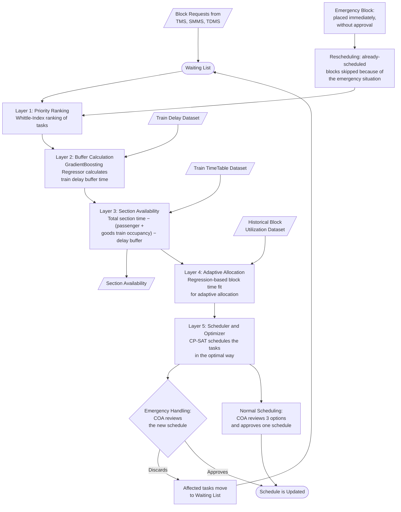

# RailBlock Co-Pilot

**AI-powered automatic block planning for Indian Railways** — turns three separate, manually-coordinated maintenance systems into one automated, conflict-free schedule.

Smart India Hackathon 2026 · Problem Statement **SIH26027** · Team **Cookies4U** (Team ID 141611)

Corridor: **Chennai Central (MAS) – Jolarpettai Jn (JTJ)**, Southern Railway (214 km)

---

## The Problem

Three departments — **Engineering** (track), **Signalling**, and **Traction** (overhead electric) — each plan their maintenance work in their own separate system (TMS, SMMS, TDMS), and coordination between them still happens by hand, on whiteboards and spreadsheets.

Because no department can see what the others are planning:

- Two departments can accidentally book the same track section at the same time.
- Work that *could* share one track closure ends up needing three separate ones.
- Planning a week's schedule takes hours to days of manual back-and-forth.
- None of this accounts for real train delays — a maintenance window planned against the timetable can get squeezed by a train that's simply running late.

## Our Solution

RailBlock Co-Pilot sits **on top of** the existing systems — it doesn't replace COA, TMS, SMMS, or TDMS. It reads what all three departments have requested and produces one combined, verified schedule.

| Feature | What it does |
|---|---|
| **Whittle-Index Priority Ranking** | Ranks every pending task by urgency, impact, and how contested its track section is — the most important work gets scheduled first. |
| **CP-SAT Conflict-Free Optimizer** | A constraint solver assigns tasks into real free time slots with a mathematical guarantee that no two tasks ever double-book the same section. It also looks for chances to combine multiple departments into one shared block instead of three separate ones. |
| **ML Adaptive Allocation** | If a task's full requested duration can't be fit in anywhere, a trained model suggests a shorter, historically-safe duration instead of leaving the task stuck waiting. |
| **Delay-Aware Dynamic Buffering** | A second trained model learns how late each train usually runs and pads its schedule slot accordingly, instead of trusting the timetable exactly. |
| **Emergency Handling** | An emergency (like a rail fracture) is placed on the schedule instantly, and the system immediately works out a new home for every task it bumped — using the same solver, not a separate emergency-only process. |

**Result:** a multi-day, error-prone manual process becomes a seconds-to-minutes automated solve with zero double-booking, by design.

## Tech Stack

| Part of the system | Built with | Why |
|---|---|---|
| Backend language | Python | one language for the API, the ML models, and the solver |
| API | FastAPI | fast, async, strongly-typed REST API |
| Database | PostgreSQL | reliable storage for requests and schedules |
| Frontend | React + Vite | fast, interactive schedule grids in the browser |
| Machine learning | scikit-learn | lightweight, explainable regression — no GPU needed |
| Optimization | Google OR-Tools (CP-SAT) | the constraint solver that guarantees no scheduling conflicts |

## Workflow

One shared scheduling engine (5 layers) feeds two paths: a normal task working its way through the Waiting List, and an emergency that displaces already-scheduled work and re-enters the same engine to find those tasks a new home.



## Datasets

| Dataset | Real or synthetic? | Source | Used for |
|---|---|---|---|
| Indian Railways train timetable | Real | [data.gov.in](https://www.data.gov.in/catalog/indian-railways-train-time-table) | Deriving the corridor's real station list; real passenger-traffic input |
| Indian Railway station codes & facilities | Real | [Kaggle](https://www.kaggle.com/datasets/shraddha4ever20/indian-railway-stations-codes-and-facilities-data?resource=download) | Double-checking the derived station list geographically |
| Per-train delay history (225 corridor trains) | Real | Scraped from [etrain.info](https://etrain.info)'s public running-history pages | Training the delay-buffering ML model |
| Government punctuality/delay records (5 files) | Real | Got through Railway officials | KPI dashboard baseline numbers |
| Real COA block-request exports (2 files, 160 rows) | Real, internal | Got through Railway officials | Anchoring the synthetic dataset below to real numbers |
| OpenStreetMap | Real | [openstreetmap.org](https://www.openstreetmap.org) | Corridor map tiles and route geometry |
| Historical block-utilization data | **Synthetic, but anchored to real data** | Every row is generated, but the statistical pattern it's generated from is fitted directly from the real COA exports above, not invented | Training the adaptive-allocation ML model |
| Maintenance task pool (TMS/SMMS/TDMS) | Synthetic | No public dataset exists for this; the *number* of tasks generated is calibrated against a real published Swedish railway benchmark, scaled to this corridor's length | The waiting list's task demand |
| Freight/goods forecast | Synthetic, not anchored | India's freight system (FOIS) has no public data feed to anchor to | Corridor availability calculation |
| Demo block history | Synthetic, not anchored | Generated only to populate the demo's "Approved"/"Completed" views | Demo purposes only |

Every synthetic value is clearly tagged as such in the code — none of it is ever presented as real. Full-size real files (the complete timetable, station master, delay history, and trained model files) are kept in a **separate private repository**, per the requirement not to publish real operational data, and are pulled in automatically when the app is deployed.

## How the Whittle-Index Ranking Works

Adapted from Gerum, Altay & Baykal-Gürsoy (2019) — their research ranks machines competing for limited repair time. We reuse that same idea for maintenance tasks competing for limited track time, not their exact mathematical model.

The core idea: an unscheduled task keeps "costing" more the longer it waits, and that cost grows faster if its track section is in high demand from other tasks too.

```
base_score      = (days overdue + 1) × priority weight × impact weight
congestion      = pending demand hours on this section ÷ average free hours per day on this section
combined_score  = base_score × (1 + congestion)

whittle_index   = tier_rank(priority) × TIER_WIDTH
                + [combined_score ÷ (1 + combined_score)] × (TIER_WIDTH − 1)

tier_rank(Critical) = 2, tier_rank(Moderate) = 1, tier_rank(Routine) = 0
TIER_WIDTH = 1000
```

- **priority weight** comes directly from the requester's own Critical / Moderate / Routine label — the system never predicts this itself.
- **impact weight** is informed by Odolinski (2019): defects likely to delay a real train are weighted higher than ones that wouldn't.
- **congestion** is what makes this a *Whittle-style* index rather than a plain priority sort — a task fighting for a busy section is more urgent to schedule *now*, because that section's free time might not come around again soon.
- The tier ordering is a hard guarantee, not just a tendency: no matter how large `combined_score` gets, a Routine task can never mathematically outrank a Moderate one, and a Moderate task can never outrank a Critical one.

Because the raw index has no fixed maximum, users see it instead as a **risk percentage** from 0–100% — "this task is more urgent than X% of everything else currently waiting."

## Current Limitations and Strategies

| Challenge | How we're addressing it |
|---|---|
| **Data confidentiality** — real COA/TMS/TDMS databases are restricted and can't be accessed directly | Every dataset that can't be real is clearly labeled synthetic, and built to match real statistical patterns (COA exports, government audit data) wherever real numbers exist to anchor to |
| **Unpredictable train delays** — a fixed timetable doesn't reflect how late trains actually run, which can squeeze a planned maintenance window | The delay-buffering ML model learns real historical delay patterns and automatically adds a safety margin around train movements |
| **Unavoidable field disruptions** — approved maintenance can be cancelled last-minute by bad weather or equipment failure | The same scheduling engine instantly finds the affected task a new slot — no separate, special-cased recovery logic |
| **Free-tier hosting is slow** — the hosting used for this MVP has limited CPU/RAM, which slows down schedule generation under load | This is a known, deliberate trade-off for a free-tier demo — see below |

**On the hosting trade-off:** free-tier CPU is genuinely too limited for the scheduling solver to run at full speed live. Because of that, the demo video was recorded on localhost hardware to show the engine's real performance; a production deployment would move to a proper paid compute tier to match it.

**Planned next steps:** a compliance tracker that automatically checks completed inspections against required safety schedules (e.g. monsoon track checks), and a weather-aware scheduler that factors in live forecasts and automatically re-queues work interrupted by rain.

## Research References

1. Gerum, Altay & Baykal-Gürsoy (2019), *"Data-driven predictive maintenance scheduling policies for railways,"* Transportation Research Part C, 107, 137–154 — basis for the Whittle-Index ranking. [Read it →](https://www.sciencedirect.com/science/article/pii/S0968090X18314918)
2. Lidén, T. (2018), *"Reformulations for integrated planning of railway traffic and network maintenance,"* OASIcs, ATMOS 2018 — basis for the maintenance-window structure the solver uses. [Read it →](https://drops.dagstuhl.de/entities/document/10.4230/OASIcs.ATMOS.2018.1)
3. Pour et al. (2019), *"A constructive framework for the preventive signalling maintenance crew scheduling problem in the Danish railway system,"* Journal of the Operational Research Society — basis for combining multiple departments into one shared block. [Read it →](https://www.researchgate.net/publication/333148155_A_constructive_framework_for_the_preventive_signalling_maintenance_crew_scheduling_problem_in_the_Danish_railway_system)
4. Odolinski, K. (2019), *"The impact of cumulative tonnes on track failures: An empirical approach,"* VTI/CTS Working Paper 2019:1 — basis for weighting defects by their real impact. [Read it →](https://ideas.repec.org/p/hhs/trnspr/2019_001.html)
5. OpenStreetMap contributors — real corridor map tiles and route data. [openstreetmap.org](https://www.openstreetmap.org)

## Links

- 🔗 **Live prototype:** [cookies4-u-sih-26027.vercel.app](https://cookies4-u-sih-26027.vercel.app)
- 🎥 **Demo video:** `<ADD YOUTUBE LINK HERE>`
